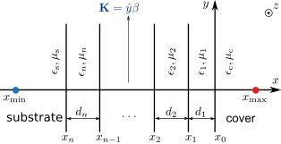

# About this Python library

This Python library is intended for calculating waveguide modes in an unbounded multilayer planar waveguide, where the optical properties $\epsilon$ and $\mu$ vary along the $x$ coordinate only, as shown in the following figure.



## Definition of a waveguide mode

In this package, a waveguide mode is assumed to propagate along the $y$-axis with a propagation constant $\beta=\kappa k_0$, where $k_0$ is the vacuum wave number and $\kappa$ denotes the effective mode index. The Cartesian coordinates are defined such that the mode has a field profile independent of $z$, i.e., 

$\mathbf{E}\left(x,y\right) =\mathbf{e}(x)e^{i\beta y}$ and

$\mathbf{H}\left(x,y\right) =\mathbf{h}(x)e^{i\beta y}$,

where $\mathbf{e}(x)$ and $\mathbf{h}(x)$ are the transverse electric and magnetic field profiles, respectively.

The transverse field profile inside the semi-infinite cladding layer is modelled analytically as a wave of an exponential form. Take a TM mode as an example, the only non-zero transverse magnetic field component inside the substrate/cover layer is expressed as

$h_{z}(x)=h_{z0}e^{i\tau_{\mathrm{s/c}} k_0 (x - x_{\mathrm{s/c}})}$, 

where $\tau_{ \mathrm{s/c} }$ is the normalized transverse wave number in the substrate/cover layer, and $h_{z0}$ is the field amplitude at the substrate/cover interface $x_{\mathrm{s/c}}$. In each layer, the following two relations

$\tau_{i}'^{2}-\tau_{i}''^{2}+\kappa'^{2}-\kappa''^{2} =\epsilon_{i}'\mu_{i}'-\epsilon_{i}''\mu_{i}''$ and 

$2(\tau_{i}'\tau_{i}''+\kappa'\kappa'') =\epsilon_{i}'\mu_{i}''+\epsilon_{i}''\mu_{i}'$

are fulfilled. Therefore, it is possible to apply a transparent boundary condition at the substrate/cover interface, by taking into account the analytical nature of the transverse field profile. In the end, this package solves a nonlinear eigenvalue problem:

$A_{0}+\lambda A_{1}+\lambda^{2}A_{2}+\lambda^{3}A_{3}+\lambda^{4}A_{4}=0$, 

with respect to the eigenvalue $\lambda$  and five system matrices $A_i$, Then, the normalized transverse wave numbers are obtained by 

$\tau_{\mathrm{c}} = {\delta^{2}}/{4\lambda} + \lambda$ and

$\tau_{\mathrm{s}} = {\delta^{2}}/{4\lambda} - \lambda$,

where $\delta^{2} = \epsilon_{\mathrm{c}}-\epsilon_{\mathrm{s}}$. The effective mode index is obtained through

where $\Sigma^{2} = \epsilon_{\mathrm{c}}+\epsilon_{\mathrm{s}}$.

More details are referred to the paper below:

Zang, Xiaorun, and Andriy Shevchenko. ‘Analysis of Guided and Leaky Modes of Planar Optical Waveguides Using Transparent Boundary Conditions’. APL Photonics 9, no. 11 (2024): 116105. [https://doi.org/10.1063/5.0221393](https://doi.org/10.1063/5.0221393).

The material in each layer may or may not be lossy. Therefore, we consider all types of modes: lossless or lossy guided modes, leaky modes of which the loss arise from the energy leak into unbounded region, or leaky modes of which the loss are resulted from both the energy leak and the material absorption.

# Setup Python environment

There are several ways of creating a Python environment. For using this package, however, it is recommended to use [Miniforge](https://github.com/conda-forge/miniforge). The main reason is that `Miniforge` seamlessly supports the installation of all the following packages:

- [petsc](https://anaconda.org/conda-forge/petsc) with complex support [required],
- [petsc4py](https://anaconda.org/conda-forge/petsc4py) with complex support [required],
- [slepc](https://anaconda.org/conda-forge/slepc) with complex support [required],
- [slepc4py](https://anaconda.org/conda-forge/slepc4py) with complex support [required],
- [ngsolve](https://ngsolve.org/downloads) [required].

Even though, ngsolve cannot be installed via conda directly, it can be easily installed through pip in a conda environment.

## The installation steps

1. Install ```miniforge``` (https://github.com/conda-forge/miniforge#Install), from which the majority of the dependent packages will be installed via ```conda```.

2. Dependencies to be installed via ```conda```,
   
   - ```numpy```, ```scipy```, and ```matplotlib```: ```conda install -c conda-forge numpy scipy matplotlib```
   
   - ```petsc```: ```conda install -c conda-forge 'petsc=*=*complex*'```
   
   - ```petsc4py```: ```conda install -c conda-forge 'petsc4py=*=*complex*'```
   
   - ```slepc```: ```conda install -c conda-forge 'slepc=*=*complex*'```
   
   - ```slepc4py```: ```conda install -c conda-forge 'slepc4py=*=*complex*'```

3. Dependencies to be installed via ```pip```,
   
   - ```ngsolve```: ```pip install ngsolve```

4. Install 'slab' via ```pip```.
   
   - ```pip install slab```

## Notes

Note that the option ```'=*=*complex*'``` will attempt to install the complex version, otherwise the float version is installed [by default] if no option is provided. The complex version is needed, because electromagnetic fields in ngsolve simulations are generally complex-valued.

In addition, ```petsc``` and ```slepc``` will be automatically installed while installing ```petsc4py``` and ```slepc4py```.

Since ```ngsolve``` cannot be installed directly and successfully from conda, we need to install ngsolve via pip, which already comes with a conda installation.

It is better to install python packages from conda at the first attempt. If that is failed, it is then necessary to install it manually from conda's pip. The reason why we don't use pip (```python -m venv /path/to/new/virtual/environment```) to create a virtual Python environment, is that the ```petsc4py``` and ```slepc4py``` cannot be installed successfully from pip.
